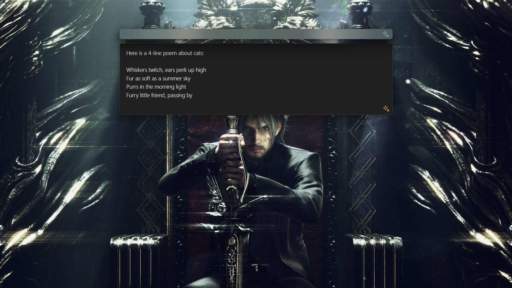
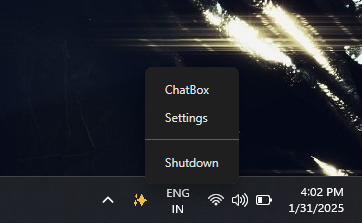
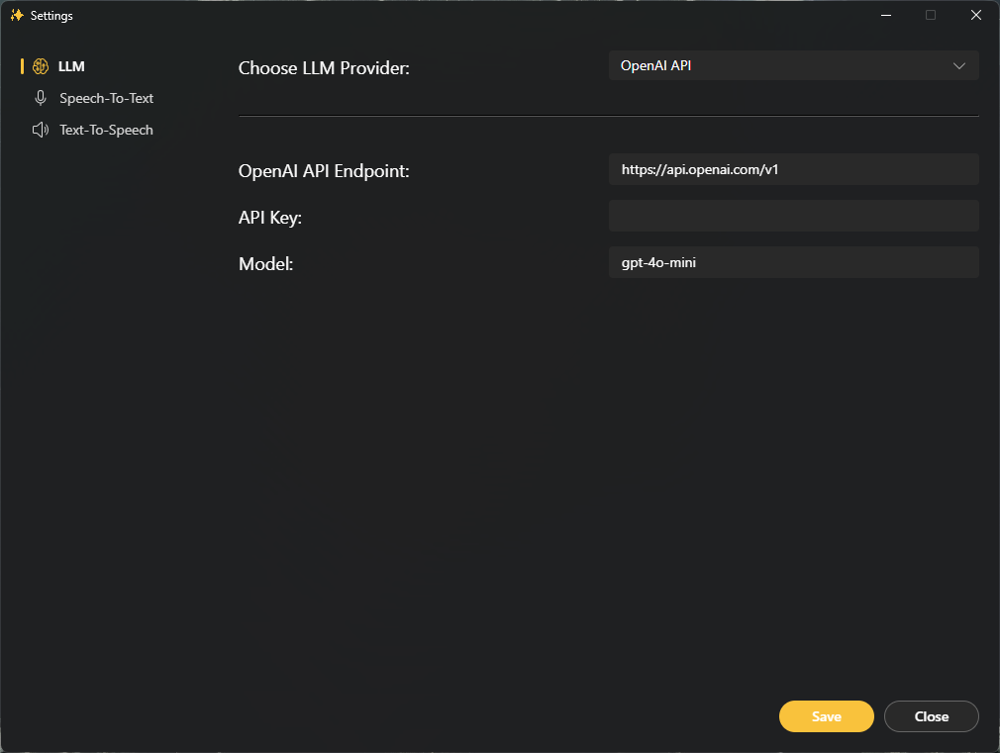
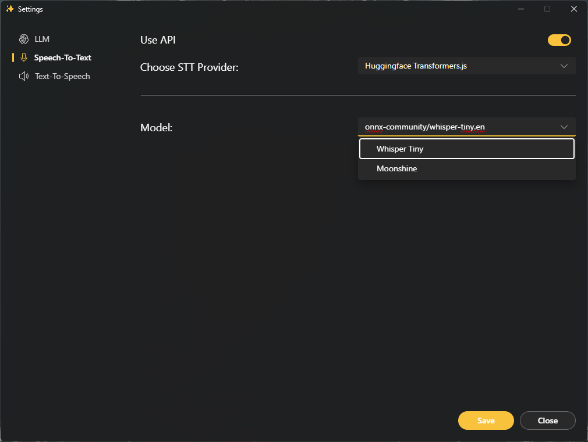
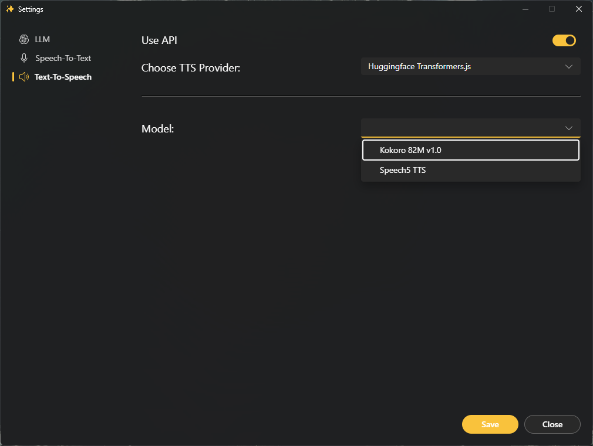
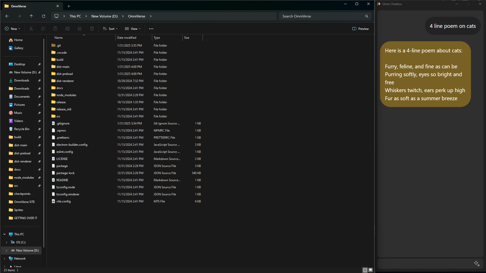

# OmniVerse Desktop



## Taskbar Shortcuts



## Settings







## Conversation View



## W.I.P

STT Integration

TTS Integration

Speech-To-Speech Interface

## Development

-   Install dependencies

    ```
    $ npm install
    ```

-   Run app in dev mode

    ```
    $ npm run dev
    ```

-   Build and package app

    ```
    $ npm run build && npm run package
    ```
