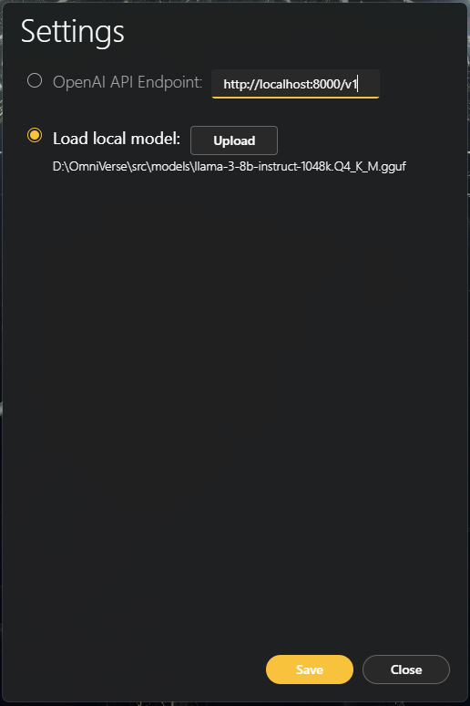

# OmniVerse Desktop


## Taskbar Shortcuts


## Model options



## Conversation View


## Development

-   Install dependencies

    ```
    $ npm install
    ```

-   Run app in dev mode

    ```
    $ npm run dev
    ```

-   Build and package app

    ```
    $ npm run build && npm run package
    ```
